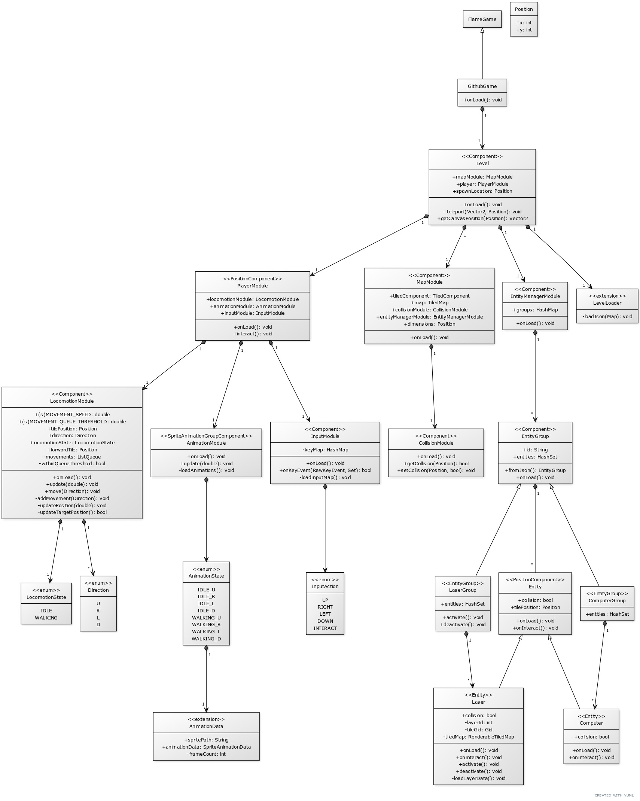

# Commands to move the player
1. W-A-S-D keys to move Up-Left-Down-Right
2. Enter key to interact with the computer

# To run the game
1. Open the project on Android Studio
2. Run `Pub get` in the terminal or use pub get option within Android Studio
3. Run the project on web, using any web browser of choice ( Google Chrome was used for the demo)
4. Interact using the keys

# Demo
[Demo video on YouTube](https://youtu.be/z8myE3y_qAw)

# Future
1. Fix bugs with the terminal screen
2. Include more levels

# Class Structure:

